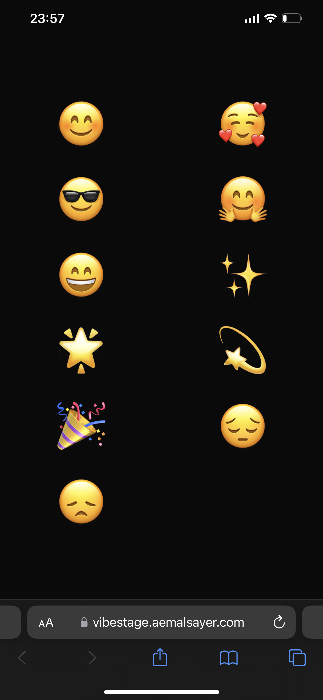

# Vibestage Electron Overlay

## Project Overview

This project is an Electron-based desktop application that creates a transparent overlay on top of all your screens, displaying large animated emojis at random positions. The overlay is always on top and click-through, allowing you to interact with your desktop and other applications while the emoji animation runs.

**Purpose**: VibeStage is an audience engagement tool designed for presentations and workshops. The presenter runs the overlay on their screen while the audience gets access to the remote control, allowing them to share their vibes and reactions in real-time. This creates an interactive and engaging experience where the audience can express their emotions, feedback, and energy through emojis and special effects that appear on the presenter's screen.

## Demo

### Desktop Overlay in Action


*Auto-playing demo: See the transparent overlay with emoji animations and confetti effects*

### Mobile Remote Control


*The mobile interface at [vibestage.aemalsayer.com](https://vibestage.aemalsayer.com/) for controlling the overlay*

## Remote Control

🎮 **Control your overlay remotely!** Open [https://vibestage.aemalsayer.com/](https://vibestage.aemalsayer.com/) on your phone, run this project on your laptop, and enjoy controlling the emoji animations from your mobile device!

---

## Inspiration

This project is inspired by [Vibestage](https://github.com/aemal/vibestage), which is a web-based interactive emoji wall platform developed as part of the Vibe Coding 101 Crash Course by Aemal Sayer ([aemalsayer.com](https://aemalsayer.com)).

- **Original Vibestage**: A web app for real-time, interactive emoji walls at events, with mobile controller and real-time sync.
- **This Project**: A desktop overlay app that runs natively on your computer, showing animated emojis on top of all screens, independent of browsers or web servers.

You can access the free crash course here: [Vibe Coding 101 Crash Course on YouTube](https://www.youtube.com/playlist?list=PLWYu7XaUG3XPeekTEk_dJC-T6Q4qPudvj)

---

## Core Features

- Transparent, always-on-top overlay across all screens
- Click-through: does not block interaction with other apps
- Large emoji displayed at random positions
- **🎉 Confetti animations** when party emoji is sent
- **🌟 Star confetti effects** when star emoji is sent
- **Remote control via mobile device**
- Runs as a native desktop app (Electron)

---

## Getting Started

### Prerequisites
- Node.js 18.0 or later
- npm (or yarn, pnpm, bun)

### Installation
```bash
# Clone the repository
# (replace <repo-url> with your actual repo URL)
git clone <repo-url>
cd vibestage-electron

# Install dependencies
npm install

# Start the app
npm start
```

### Remote Control Setup
1. **Start the desktop overlay**: Run `npm start` on your laptop
2. **Open the remote control**: Visit [https://vibestage.aemalsayer.com/](https://vibestage.aemalsayer.com/) on your phone
3. **Send emojis**: Tap emojis on your phone to see them appear on your laptop screen
4. **Special effects**: 
   - Send 🎉 for colorful confetti animation
   - Send 🌟 for golden star confetti effect

---

## Project Structure
```
vibestage-electron/
├── main.js         # Electron main process (window, overlay logic)
├── index.html      # Overlay UI (emoji display)
├── renderer.js     # Emoji animation logic and confetti effects
├── firebase-config.js # Firebase configuration for real-time sync
├── .gitignore      # Git ignore rules
├── LICENSE         # MIT License
└── ...             # Other config files
```

---

## License

This project is licensed under the MIT License. See [LICENSE](./LICENSE) for details.

---

## Credits
- Inspired by [Vibestage](https://github.com/aemal/vibestage) by Aemal Sayer
- Part of the [Vibe Coding 101 Crash Course](https://www.youtube.com/playlist?list=PLWYu7XaUG3XPeekTEk_dJC-T6Q4qPudvj)
- Created by Aemal Sayer ([aemalsayer.com](https://aemalsayer.com)) 